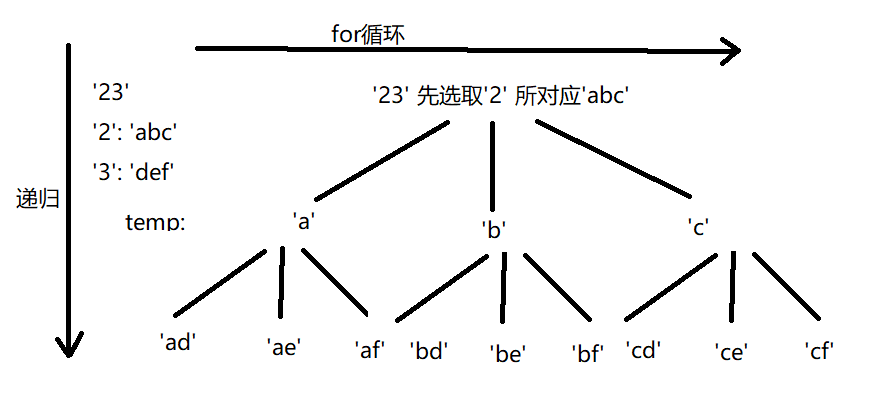

[toc]
# 回溯
2021-10-30 ~2021-11-07 8天
## 概览
递归函数实现 属于纯暴力搜索
- 组合
- *切割
- 子集
- 排列
- *棋盘  N皇后/解数独
以上情况不能够使用for循环进行解决，必须要使用回溯法。

上述分类代码间略微不同，一一描述:
1. 组合vs切割-->组合(列表)vs切割(字符串)
2. 组合vs子集 叶子节点集合(基础组合问题)、所有节点集合(基础子集问题)
3. 组合vs排序 排序问题在组合基础上使用used记录是否元素使用过，共同点都是树的叶子节点集合
4. 子集vs递增子序列 所有节点集合，相较于子集要考虑去重(树层位置去重(同一循环)，树枝位置的去重(同一递归))
5. 棋盘问题，逐行获取，条件判断
6. 对象 ...

## 思路
既有循环又有递归，**每一层递归中都嵌套一个循环，那么递归可以解决多层嵌套循环的问题。**
三步走
1. 确定回溯函数参数
2. 确定终止条件
3. 确定单层搜索逻辑，一般会配合一些判断条件(回文...)




## 模板
```python
def backtracking(参数):
    if 终止条件:
        收集结果
        return
    for 集合元素集:
        处理节点
        递归函数
        回溯操作
```
## 分类细讲
### 切割
例子：输入'abb',输出[['a','bb'].['a','b','b']]
- 切割问题 切取一个字符'a'后,在'bb'中切割第二段，以此类推
- 组合问题 选取一个字符'a'后，在'bb'中继续选择第二个字符...

[131. 分割回文串](https://leetcode-cn.com/problems/palindrome-partitioning/solution/131-fen-ge-hui-wen-chuan-hui-su-jian-zhi-kqnw/)
#### 递归函数参数
全局变量
- 列表temp，存放切割后的字符串
- 列表ans，存放所有结果
局部变量
- 需要被切割的字符串 s
- 切割过的地方不同重复切割，引入startIndex参数，与组合问题是否重复类似

#### 递归停止条件
切割完成，temp正好包含所有字符串
最后一次传入传递函数 字符串为空字符''
```python
if s == '':
    ans.append(temp[:])
    return
```
#### 单层循环搜索操作
首先判断是否满足条件，如果满足，那么将切割获得字符串存入temp，接下来切割剩余字符串，第三步就是进行回溯操作，将递归上一行代码存入的字符串释放，重新寻找下一个答案。

#### 没有任何条件，返回该字符串所有切割方法
**循环遍历的边界**
```python
# error
ans = []
temp = []
def backtracking(s, startIndex):
    if s == '':
        ans.append(temp[:])
        return
    for i in range(startIndex, len(s)+1):
        temp.append(s[:i])
        backtracking(s[i:], i+1)
        temp.pop()
```
```python
# right
ans = []
temp = []
def backtracking(s,length):
    if s == '':
        ans.append(temp[:])
        return
    for j in range(1,len(s)+1):
        temp.append(s[:j])
        backtracking(s[j:],len(s)-j)
        temp.pop()
```
#### 难点
- 切割问题递归终点
- *切割问题如何获得子串

#### 细节 
- 本题还有细节，例如：切割过的地方不能重复切割所以递归函数需要传入i + 1


### leetcode 相关题解
[77.组合](https://leetcode-cn.com/problems/combinations/solution/zu-he-hui-su-fa-ji-chu-li-ti-by-shangcy-rzye/)


### 参考
[代码随想录--回溯](https://programmercarl.com/0131.%E5%88%86%E5%89%B2%E5%9B%9E%E6%96%87%E4%B8%B2.html#_131-%E5%88%86%E5%89%B2%E5%9B%9E%E6%96%87%E4%B8%B2)